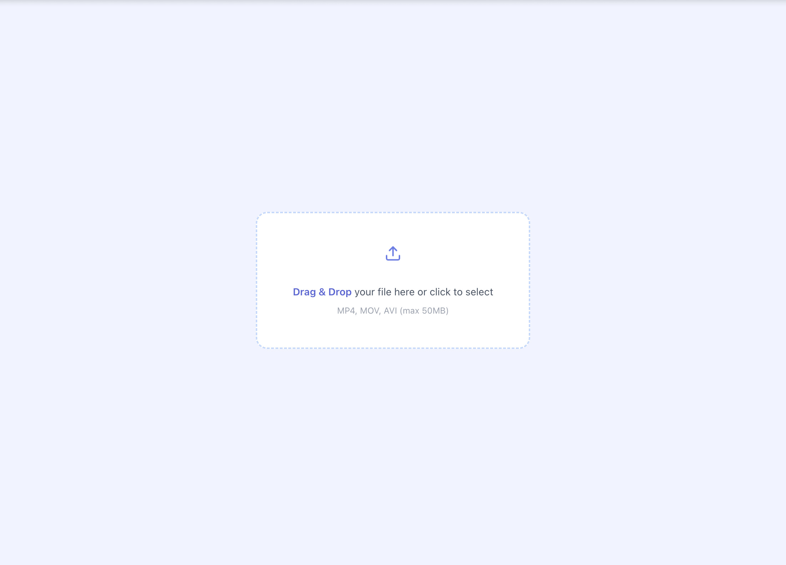
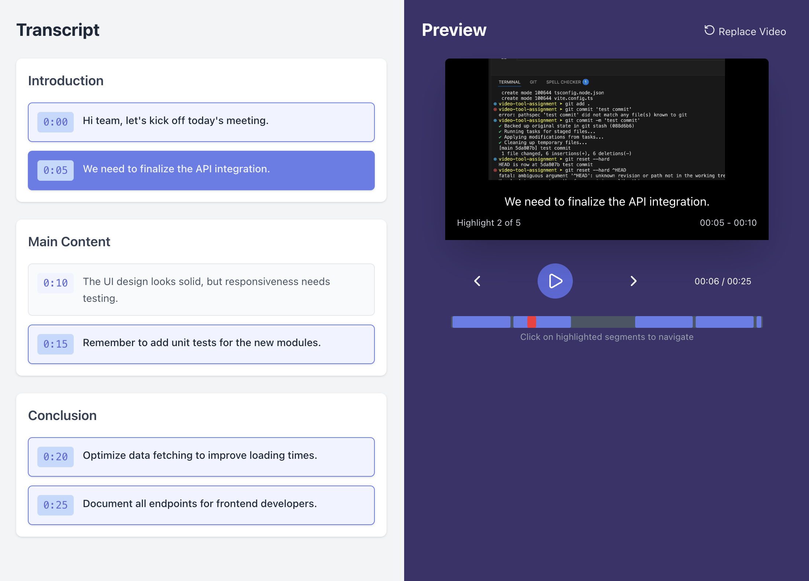
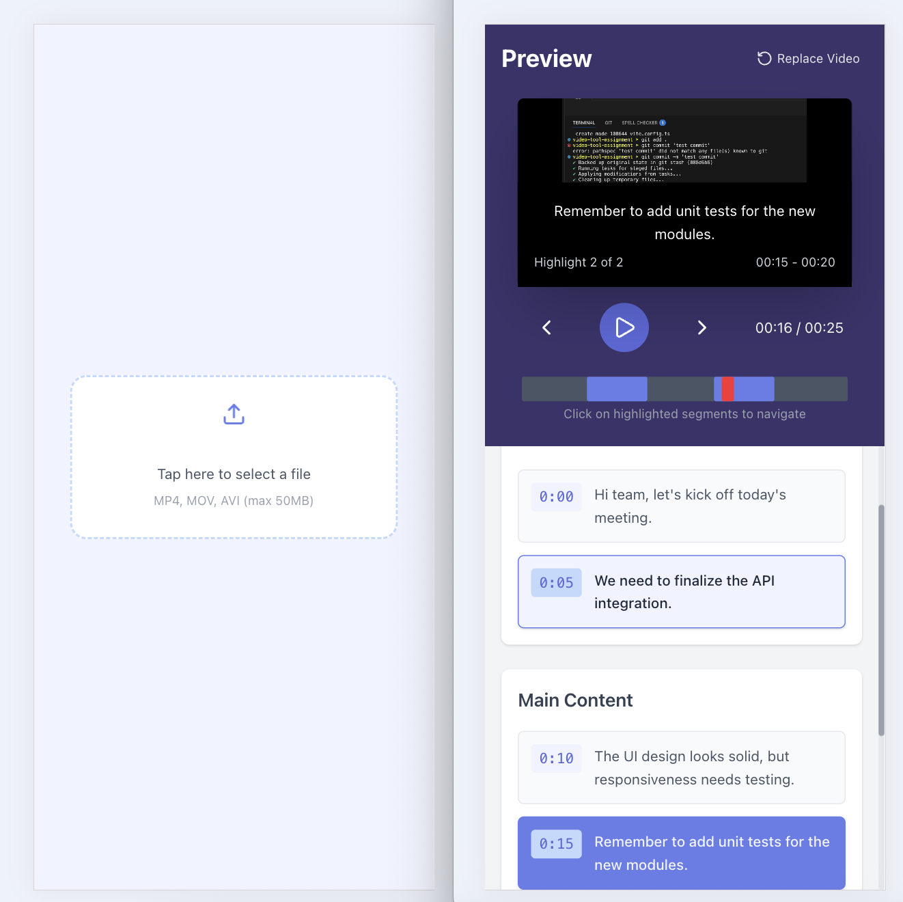

# Video Highlight Tool (Demo)

This project is a demo frontend tool that allows users to upload a video, automatically generate transcripts, select highlight sentences, and preview a highlight clip with transcript overlay.

## Key Features

- Upload video files
- Mock AI processing to generate transcript & suggested highlights
- Editing Area (Left): select/unselect sentences, clickable timestamps, auto-scroll
- Preview Area (Right): shows selected highlight clip, transcript overlay, smooth transitions
- Synchronization between editing and preview
- Responsive design for desktop & mobile

## Tech Stack & Engineering Decisions

- **React + TypeScript + Vite**: fast development, type safety
- **Zustand**: global state management for transcript, selected sentences, and video playback; enables easy syncing between Editing and Preview areas
- **Pure functions** (playlist.ts, selection.ts): isolate core logic for maintainability and testing
- **Mock API**: decouples frontend from backend, easy to swap with real AI service
- **RWD**: Flex/Grid layout; mobile stacked, desktop split-screen
- **Testing**: Vitest + React Testing Library for core logic & UI
- **Deployment**: Hosted on Vercel for automatic CI/CD deployment; every push to main branch triggers a new build and updates the live demo

## Installation & Running

```bash
# Clone repository
git clone https://github.com/yaruohsu/video-tool-assignment
cd video-highlight-tool

# Install dependencies
npm install

# Run development server
npm run dev
```

Open `http://localhost:3000` to see the demo.

## Deployment

The project is deployed on **Vercel**: [Live Demo](https://video-tool-assignment.vercel.app).  By setting `VITE_USE_MSW=true` on vercel, MSW is now supported in production.

**Vercel Deployment Workflow:**

1. Push your code to GitHub.
2. Import the repository into Vercel.
3. Vercel automatically detects the framework (`Vite + React`) and sets:
   - Build Command: `npm run build`
   - Output Directory: `dist`

4. After deployment, every push to the main branch automatically triggers a new build and updates the live demo.

## Folder Structure

```
video-highlight-tool/
├─ src/
│  ├─ app/
│  ├─ api/
│  ├─ mocks/                # Mock AI API, msw
│  ├─ constants/
│  ├─ styles/
│  ├─ modules/
│  │   ├─ components/
│  │   ├─ store/            # Zustand store
│  │   ├─ editor/           # Transcript editing area
│  │   ├─ preview/          # Highlight preview area
│  │   ├─ upload/           # Video upload component
│  │   └─ hooks/            # Reusable hooks
│  └─ main.tsx
├─ index.html
├─ package.json
├─ tsconfig.json
├─ vite.config.ts
└─ README.md
```

## State Management

### Store

Each store updates independently to avoid unnecessary re-renders:

- **useTranscriptStore** – handles transcript text and selection state
- **useTimelineStore** – handles playback time and timeline data
- **useVideoStore** – handles video files

### Data Flow

```
API Response → useVideoProcessing →
   ├── TranscriptStore (sections, segments, selection)
   ├── TimelineStore (timeline data, playback state)
   └── VideoStore (video metadata)
```


## Screenshots

### Desktop




### Mobile


